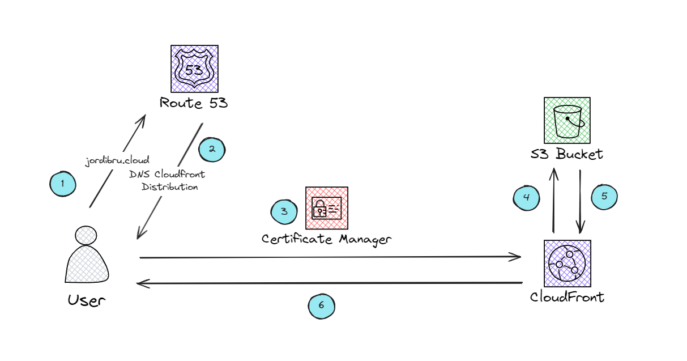

# aws-static-website

Terraform module to host a static website in an S3 bucket using the following self-managed modules: aws-s3-bucket, aws-route53, aws-acm, and aws-cloudfront. This module is designed for personal usage and will use the custom domain `jordibru.cloud`. At this moment, there is no intention of using another domain, so everything is created around `jordibru.cloud`. The resources are specified to be the most basic configuration that enables setting up a static website on S3 with just one `apply`.

In addition, once the module creation is completed, the S3 bucket will be empty. This is intentional, as I consider uploading the files through a different method rather than using Terraform. This approach allows for more flexibility and control over the content deployment process, enabling you to use tools better suited for file uploads, such as AWS CLI, SDKs, or CI/CD pipelines.

## Related Modules

| Module            | Description                             | Link                                                                 |
|-------------------|-----------------------------------------|----------------------------------------------------------------------|
| `aws-s3-bucket`   | Manages S3 buckets                      | [aws-s3-bucket](https://github.com/JordiiBru/aws-s3-bucket)          |
| `aws-route53`     | Manages Route 53 hosted zones and records | [aws-route53](https://github.com/JordiiBru/aws-route53)              |
| `aws-cloudfront`  | Manages CloudFront distributions         | [aws-cloudfront](https://github.com/JordiiBru/aws-cloudfront)        |
| `aws-acm`         | Manages AWS Certificate Manager (ACM)    | [aws-acm](https://github.com/JordiiBru/aws-acm)                      |


## Naming Conventions

It is important to note that the naming of the S3 bucket follows the AWS requirement that the bucket name must match the domain name used. The bucket name is automatically generated to adhere to this rule, ensuring compatibility with AWS's static website hosting requirements:

- When the stage is set to "production", the S3 bucket name will be `${var.purpose}.jordibru.cloud`.
- For all other stages, the bucket name will follow the format `${var.stage}-${var.purpose}.jordibru.cloud`.

## Required Variables

| Name      | Description                                    | Type   | Validation                                | Default |
|-----------|------------------------------------------------|--------|-------------------------------------------|---------|
| `stage`   | The stage of development (e.g., test, dev, staging, prod). | string | Must be one of `test`, `dev`, `staging`, `prod` | N/A     |
| `purpose` | A short description about the purpose of the created resource. | string | Must match the regex `^[a-zA-Z0-9-_]*$`   | N/A     |
| `owner`   | The owner of the deployed infrastructure.      | string | Must have more than three characters      | N/A     |

## Custom Variables

| Name               | Description                               | Type   | Default              |
|--------------------|-------------------------------------------|--------|----------------------|
| `bucket_versioning`| Enable versioning on the S3 bucket.       | bool   | `false`              |
| `static_website`   | Configure the S3 bucket to host a static website. | bool   | `true`               |

## Outputs

| Name                      | Description                                          |
|---------------------------|------------------------------------------------------|
| `bucket_name`             | The name of the S3 bucket hosting the static website.|
| `bucket_arn`              | The ARN of the S3 bucket hosting the static website. |
| `cloudfront_distribution_arn` | The ARN of the CloudFront distribution.              |
| `cloudfront_domain_name`  | The domain name of the CloudFront distribution.      |
| `cloudfront_zone_id`      | The hosted zone ID of the CloudFront distribution.   |
| `acm_certificate_arn`     | The ARN of the ACM certificate used for the CloudFront distribution. |
| `route53_zone_name`       | The name of the Route 53 hosted zone.                |
| `route53_zone_id`         | The ID of the Route 53 hosted zone.                  |
| `route53_record_name`     | The name of the Route 53 record for the CloudFront distribution. |

## Module diagram



## Usage

```hcl
module "static" {
  source = "git@github.com:JordiiBru/tf-static-website.git?ref=[TAG]"

  # Required variables
  stage   = "dev"
  owner   = "wanda"
  purpose = "portfolio"

  # Custom variables
  bucket_versioning = true
}
```